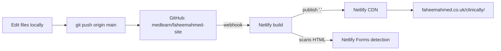
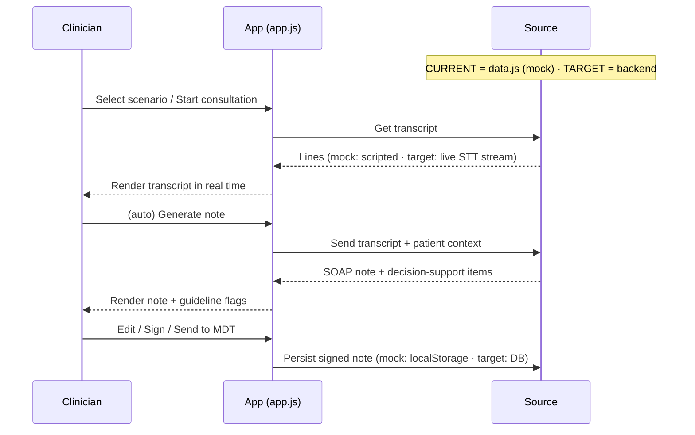
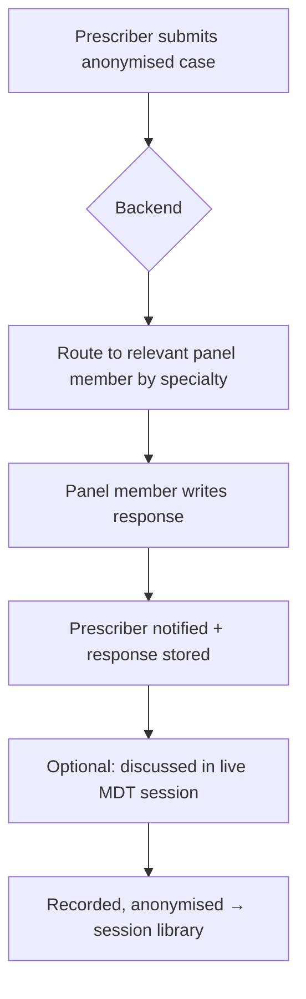
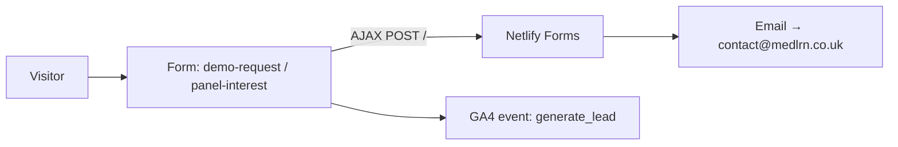
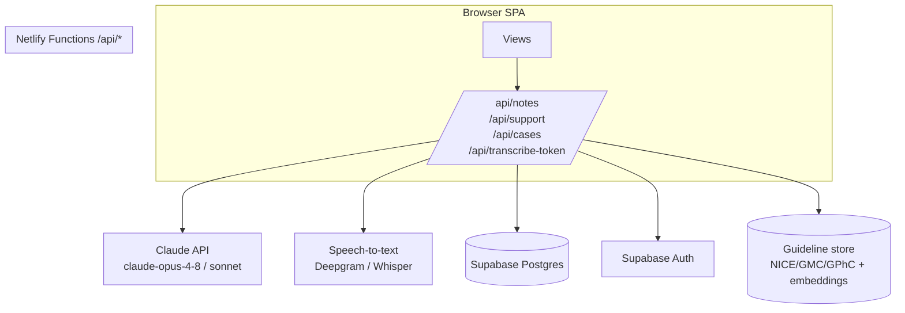

# Clinickly Co-pilot — Developer Handoff & Workflow Structure

**Status:** Front-end prototype (live). All "AI" output is pre-authored/mocked. No backend, no real patient data, nothing leaves the browser.
**Goal of this doc:** give a developer everything needed to understand the current build and take it to a production product.

**Live now:**
- Landing/marketing: `https://faheemahmed.co.uk/clinically/`
- Interactive demo app: `https://faheemahmed.co.uk/clinically/app/`
- Intended brand domain: `copilot.clinickly.com` (subdomain — not yet wired; see §8)

---

## 1. The concept (what we're building)

Clinickly Co-pilot has **two pillars**:

1. **AI co-pilot (software)** — sits with the clinician during/around a consultation. Ambient transcription → drafts a structured clinical note (SOAP) → surfaces guideline-backed decision support. Plus guidelines search, templates/SOPs, training. *It supports judgement, never decides.*
2. **Human MDT (people)** — a multidisciplinary panel (GP, psychiatrist, dermatologist, chair) that prescribers submit anonymised cases to and meet with. Software-assisted, but the value is human.

Governance principle baked into the UX: **the treating clinician stays in charge and accountable throughout.**

---

## 2. Current status — real vs mocked

| Area | Current state | Production need |
|------|---------------|-----------------|
| UI / UX / flows | ✅ Real, complete | Keep / refine |
| Transcription | ❌ Scripted playback (`data.js`) | Real speech-to-text |
| Note drafting (SOAP) | ❌ Pre-written per scenario | Real LLM (Claude) |
| Decision support | ❌ Pre-written | Real LLM + guideline retrieval |
| Guidelines / templates / training | ❌ Static mock content | CMS or DB-backed |
| Accounts / auth | ❌ None (single demo clinician) | Auth + multi-tenant |
| Data persistence | ⚠️ `localStorage` only | Database |
| MDT case submission | ⚠️ Stored in `localStorage` | Backend + panel workflow |
| Lead capture forms | ✅ Real (Netlify Forms → email) | Keep or move to CRM |
| Analytics | ✅ Real (GA4 `generate_lead`) | Keep |

---

## 3. Repository & file map

Repo: `github.com/medlearn/faheemahmed-site` (the Clinickly demo lives in a subfolder of Faheem's personal site repo).

```
clinically/
├── index.html          # Landing/marketing page (self-contained CSS + JS)
├── HANDOFF.md          # ← this file
├── app/                # The interactive product demo (the SPA)
│   ├── index.html      # App shell: sidebar, topbar, icon sprite, demo banner
│   ├── app.css         # All app styles (design tokens at top)
│   ├── app.js          # Routing + all views + interactions (~650 lines)
│   └── data.js         # ALL mock data (scenarios, notes, guidelines, MDT…)
└── social/             # Marketing assets
    ├── POSTS.md        # Ready LinkedIn copy
    ├── og.png, post-*.png   # Social cards (1200×630 / 1080²)
    └── src/            # HTML templates → rendered to PNG via headless Chrome
```

Shared infra already in the repo (reusable for production — built for the `/library/` product):
```
netlify/functions/     # Netlify serverless functions (Node)
netlify.toml           # publish=".", /api/* → functions, copilot.clinickly.com rewrite
supabase/              # Supabase config (auth + Postgres already used elsewhere)
.env(.example)         # SUPABASE_*, STRIPE_*, BUNNY_* keys
```

---

## 4. Tech stack

- **Front end:** vanilla HTML/CSS/JS. No framework, no build step. The app is a **hash-routed SPA** (`#dashboard`, `#consult`, …) rendered entirely client-side.
- **Fonts:** Google Fonts — Bodoni Moda (display), Hanken Grotesk (body), IBM Plex Mono (mono).
- **Hosting:** Netlify, auto-deploy on push to `main` (`publish = "."`, no build command).
- **Forms:** Netlify Forms (`demo-request`, `panel-interest`).
- **Analytics:** GA4 (`G-6RG1R95GPT`).
- **Available for production (already wired in this repo for `/library/`):** Netlify Functions (Node), Supabase (Postgres + Auth), Stripe (billing), Bunny (media/CDN).

---

## 5. Front-end architecture (the app)

`app.js` is one IIFE. Key pieces:

- **`CA_DATA`** (`data.js`) — the entire content/data layer. Swap this for API calls in production.
- **`NAV`** — declares the two nav groups (Co-pilot, MDT) and their views.
- **`VIEWS`** — an object of render functions, one per screen. `route()` reads the URL hash, finds the view, and calls `VIEWS[id](container)`.
- **State** — `state = { savedNotes, cases, training, demobarDismissed }`, persisted to `localStorage` key `clinically_demo_v1`. **This is the seam where a real backend plugs in.**
- **Helpers** — `toast()`, `modal()`, `el()`, `esc()`.

To productionise: replace the `CA_DATA` reads and the `localStorage` `save()/load()` with `fetch()` calls to API endpoints (see §7), keeping the view-render layer mostly intact.

---

## 6. Workflows

### 6.1 Deployment workflow (current)



### 6.2 Consultation → note (current mock vs target)



### 6.3 MDT case workflow


*Current demo:* submission + tracking is `localStorage` only; responses are pre-written in `data.js`. *Target:* real submission store, notifications, panel auth, scheduling.

### 6.4 Lead capture (live, real)



---

## 7. Production architecture (target) & API contracts



**Suggested endpoints** (Netlify Functions, mirror the `/api/*` pattern already in `netlify.toml`):

| Endpoint | Method | Purpose |
|----------|--------|---------|
| `/api/notes` | POST | `{transcript, patientContext}` → returns SOAP note JSON. Calls Claude. |
| `/api/support` | POST | `{transcript/note}` → guideline-backed decision-support items (+ retrieval). |
| `/api/transcribe-token` | GET | Short-lived token for the STT provider (don't expose keys client-side). |
| `/api/cases` | GET/POST | Create/list MDT cases. |
| `/api/cases/:id/response` | POST | Panel member submits a response (panel-auth required). |
| `/api/guidelines` | GET | Search guideline store. |

**LLM note-drafting contract (example):** system prompt sets role ("draft a SOAP note from this consultation transcript; do not invent findings; flag uncertainty; output JSON {S,O,A,P,codes}"). Use **structured/JSON output**. Model: default to the latest Claude (`claude-opus-4-8`); `claude-sonnet-4-6` for cheaper/faster. See the repo's `claude-api` reference / Anthropic SDK.

---

## 8. Hosting & domain

- **Current:** served from `faheemahmed.co.uk/clinically/` (Netlify, auto-deploy from `main`).
- **Target:** `copilot.clinickly.com`. `netlify.toml` already contains the rewrite `https://copilot.clinickly.com/* → /clinically/:splat`.
- **Blocker:** the subdomain is currently claimed by the **clinic site's** Netlify project (`clinickly.com`). To finish: free `copilot.clinickly.com` (or `*.clinickly.com`) on that project → add it as a domain alias on the faheemahmed site → add a CNAME at IONOS (`clinickly.com` DNS is at IONOS) pointing `copilot` to the Netlify target.
- App internal links use **relative paths** (`../`), so it works at any base path/domain.

---

## 9. Production build-out plan (phased)

1. **Real note drafting** — `/api/notes` → Claude with structured output. Replace mock note generation in `app.js` (`generateNote()`). *Highest value, lowest effort.*
2. **Real decision support** — `/api/support`; ideally with retrieval over a guideline store (RAG) so citations are real.
3. **Transcription** — browser mic → streaming STT (Deepgram/AssemblyAI) or chunked Whisper. Token-broker via `/api/transcribe-token`.
4. **Auth & accounts** — Supabase Auth (already in repo). Multi-tenant: clinician, clinic, panel-member roles.
5. **Persistence** — Postgres schema (see §10). Move notes/cases/training off `localStorage`.
6. **MDT backend** — case routing, panel responses, notifications, scheduling, session library (video via Bunny, already in repo).
7. **Billing** — Stripe (already in repo) for clinic subscriptions / early-access.
8. **Compliance & clinical safety** — see §11. Do this *before* any real patient data.

---

## 10. Data model (current shapes → proposed schema)

Current mock shapes live in `data.js` (`scenarios`, `notes`, `guidelines`, `templates`, `training`, `panel`, `cases`, `library`). Proposed production tables:

```
users(id, role[clinician|panel|admin], name, reg_number, clinic_id, …)
clinics(id, name, …)
consultations(id, clinician_id, patient_ref, reason, created_at)
notes(id, consultation_id, type, s, o, a, p, codes[], status[draft|signed], signed_at)
decision_support(id, note_id, level, title, body, ref)
mdt_cases(id, clinician_id, specialty, title, summary, status, responder_id, created_at)
mdt_responses(id, case_id, panel_member_id, body, created_at)
mdt_sessions(id, date, agenda, recording_url, …)
guidelines(id, source, code, title, summary, tags[], updated, body)
```
**No patient-identifiable data** in MDT cases — anonymisation is a product rule (enforce server-side too).

---

## 11. Compliance & security (healthcare — do not skip)

- **Clinical safety:** UK digital clinical-risk standards **DCB0129 / DCB0160** apply to clinical decision-support software. Appoint a Clinical Safety Officer; produce a hazard log.
- **Data protection:** UK GDPR. DPIA before processing patient data. Lawful basis, data residency (keep in UK/EU), retention, subject-access/erasure.
- **Don't expose keys:** all LLM/STT keys server-side (Netlify Functions env vars). Never in client JS.
- **Auditability:** the product's selling point is a defensible audit trail — log who/what/when on every note + decision-support shown.
- **Scope framing:** keep the "supports, does not decide / accountability stays with the prescriber" framing in UI and T&Cs.
- **MDT framing:** advisory peer input, not transfer of responsibility; sort indemnity/consent before launch.

---

## 12. Environment variables (add for production)

```
ANTHROPIC_API_KEY=         # Claude API (note drafting + support)
DEEPGRAM_API_KEY= / OPENAI_API_KEY=   # speech-to-text (pick one)
SUPABASE_URL= / SUPABASE_ANON_KEY= / SUPABASE_SERVICE_ROLE_KEY=   # already in repo
STRIPE_SECRET_KEY= …       # already in repo (billing)
```

---

## 13. Open decisions for product owner

- STT provider (cost vs latency vs on-prem/UK data residency).
- Build real guideline retrieval (RAG) vs link-out to NICE/CKS.
- MDT scheduling: build vs integrate (e.g. calendar tooling).
- Keep vanilla JS or migrate the app to a framework (React/Svelte) before adding auth/state complexity. *Recommendation: migrate to a framework at Phase 4, keep the current views as the design reference.*
- Index the marketing page (currently `noindex`).

---

*Questions on any of this — the views in `app.js` are the source of truth for intended behaviour; `data.js` shows the exact data shapes the UI expects.*
