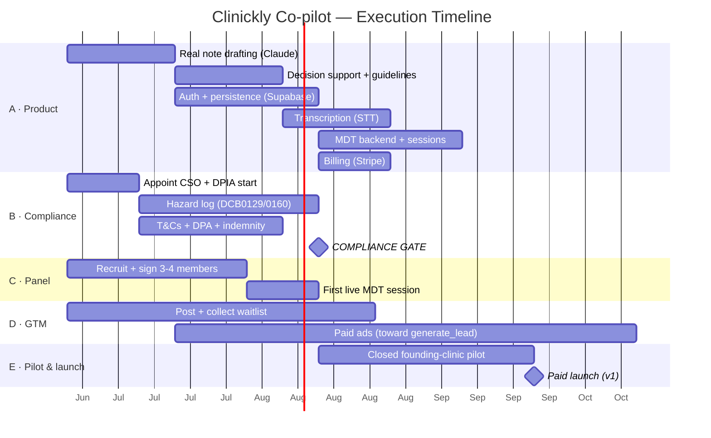

# Clinickly Co-pilot — Master Execution Plan

**Owner:** Faheem Ahmed · **Status:** demo + marketing live; pre-MVP
**Companion docs:** [HANDOFF.md](HANDOFF.md) (technical) · [social/POSTS.md](social/POSTS.md) (marketing copy)
**Last updated:** 2026-06-24

> One-line strategy: **validate demand now → build the AI engine and clinical-safety foundations in parallel → run a closed founding-clinic pilot → open paid launch.** Never put real patient data through it until the compliance gate (§ Gate B) is cleared.

---

## 0. Where we are today (baseline)

- ✅ Interactive demo live (`/clinically/app/`) — full UX, mocked AI.
- ✅ Marketing page live with two working lead forms (`demo-request`, `panel-interest`) → email + GA4 conversion tracking.
- ✅ LinkedIn / social kit ready.
- ⏳ Domain `copilot.clinickly.com` pending logins.
- ❌ No real AI, no auth, no database, no compliance work yet.

---

## 1. Workstreams (run in parallel)

| # | Workstream | Outcome | Lead |
|---|-----------|---------|------|
| A | **Product & Engineering** | Demo → MVP → v1 (real AI, auth, data) | Developer |
| B | **Clinical governance & compliance** | Safe, lawful to handle patient data | Faheem + Clinical Safety Officer |
| C | **MDT panel** | Contracted panel + running sessions | Faheem (chair) |
| D | **Go-to-market & marketing** | Pipeline of clinics + clinicians | Faheem |
| E | **Commercial** | Pricing, billing, founding customers | Faheem |
| F | **Legal & ops** | Entity, T&Cs, DPAs, indemnity | Faheem + solicitor |

---

## 2. Timeline

*(Durations are planning estimates for a solo founder + one developer; compress/expand to actual capacity.)*

---

## 3. Phases, gates & exit criteria

### Phase 0 — Validate & lay foundations (Now → ~2 weeks)
**Goal:** prove there's demand and start the slow-burn (compliance, panel) early.
- D: Post the launch sequence; drive traffic; collect `demo-request` + `panel-interest`.
- C: Have first conversations with panel candidates (GP, psychiatrist, dermatologist, chair).
- B: Appoint a **Clinical Safety Officer**; begin **DPIA**; engage a solicitor for T&Cs/DPA.
- E: Decide a **pricing hypothesis** (e.g. per-clinician/month + founding discount).
- F: Confirm trading entity, business bank, insurance basics.
**Exit (Gate A — "worth building"):** ≥10 qualified demo-requests OR ≥5 booked demos, AND ≥2 panel members verbally committed.

### Phase 1 — MVP engine + compliance groundwork (Weeks ~2–8)
**Goal:** make the AI real and lawful-ready.
- A: `/api/notes` (real Claude SOAP drafting) → `/api/support` → **auth + persistence**. (See HANDOFF §7, §9.)
- B: Hazard log progressing; DPIA draft; T&Cs + DPA + panel indemnity drafted.
- C: Sign **3–4 panel members** (written terms); define session cadence & async case SLA.
- D: Keep posting; start small **paid ads** optimised to `generate_lead`.
**Exit:** working note-drafting demo with login on staging; panel contracted; compliance docs in draft.

### Phase 2 — Closed founding-clinic pilot (Weeks ~8–14)
> **⛔ Gate B — Compliance gate:** do NOT onboard real patient data until DCB0129/0160 hazard log signed off, DPIA complete, DPA + T&Cs executed, keys server-side, audit logging live.
**Goal:** real clinicians using it on real workflows, tightly supported.
- A: Transcription live; MDT backend (case submission + panel responses); **first live MDT session**.
- E: Stripe live; onboard **3–5 founding clinics** at founding pricing.
- B/C: Run the real MDT loop; capture reflective/CPD evidence; iterate on safety.
**Exit (Gate C — "ready to sell"):** founding clinics retained & generating notes weekly; ≥1 completed MDT cycle; no unresolved safety hazards; ≥1 testimonial/case study.

### Phase 3 — Paid launch v1 (Months ~3–6)
**Goal:** open early access → paid, scale acquisition.
- E: Public pricing; convert waitlist; remove `noindex`, enable SEO.
- D: Ramp ads + content using pilot case studies; PR to pharmacy/prescriber networks.
- C: Expand specialties as case mix grows.

### Phase 4 — Scale (Months ~6–12)
Integrations (PMR/EHR), more specialties, partnerships (pharmacy groups), consider fundraising. Optional: migrate front end to a framework (HANDOFF §13).

---

## 4. KPIs by phase

| Phase | Primary metrics |
|-------|-----------------|
| 0 Validate | demo-requests, demos booked, panel verbal commits |
| 1 MVP | note-draft quality (clinician rating), panel signed, ad CPL |
| 2 Pilot | active clinics, notes/clinic/week, MDT cases handled, retention |
| 3 Launch | paying clinics, MRR, CAC:LTV, activation rate |
| 4 Scale | MRR growth, churn, specialty coverage, NPS |

---

## 5. Critical dependencies & sequencing rules

1. **Compliance gate (B) blocks real patient data** — Phase 2 pilot cannot use identifiable data until Gate B passes. (Pilot can start on anonymised/synthetic if needed.)
2. **Auth + persistence (A3) blocks** MDT backend, billing, and the pilot.
3. **Panel signed (C1) blocks** the first live session and the MDT value proposition in sales.
4. **Real note drafting (A1) is the highest-leverage first build** — it's what the demo promises.

---

## 6. Risk register (top risks)

| Risk | Impact | Mitigation |
|------|--------|------------|
| Clinical safety / liability | Severe | Gate B; CSO; "supports not decides" framing; audit trail; indemnity |
| Data protection breach | Severe | DPIA, UK/EU data residency, keys server-side, least-privilege, encryption |
| AI note errors / hallucination | High | Structured output, clinician-reviews-&-signs, no auto-prescribe, eval set |
| Panel can't be staffed | High | Start C now; paid sessional model; warm network; staggered specialties |
| No demand / weak conversion | High | Phase 0 gate before heavy build; iterate landing on real data |
| Founder bandwidth (solo) | Med | Sequence ruthlessly; outsource dev + legal; don't build Phase 3 before Gate C |
| Domain/brand fragmentation | Low | Consolidate on copilot.clinickly.com when logins available |

---

## 7. Immediate next 14 days (do these now)

- [ ] **D** — Publish launch post from Clinickly LinkedIn; share everywhere (kit ready in POSTS.md).
- [ ] **D** — Confirm both Netlify form notifications work (test submit each).
- [ ] **C** — Book 3 panel conversations (GP / psychiatrist / dermatologist).
- [ ] **B** — Identify & appoint a Clinical Safety Officer; book solicitor for T&Cs/DPA.
- [ ] **A** — Brief developer using HANDOFF.md; agree Phase 1 scope + estimate; get `ANTHROPIC_API_KEY`.
- [ ] **E** — Draft pricing hypothesis (founding-clinic offer).
- [ ] **Ops** — Sort `copilot.clinickly.com` (free the subdomain on the clinic project) → tell Claude to flip the links.

---

## 8. Decision log (fill in as you go)

| Date | Decision | Notes |
|------|----------|-------|
| 2026-06-24 | Brand = Clinickly Co-pilot; host on copilot.clinickly.com (subdomain) | Apex is the clinic site |
| | Pricing model | TBD |
| | STT provider | TBD |
| | CSO appointed | TBD |
